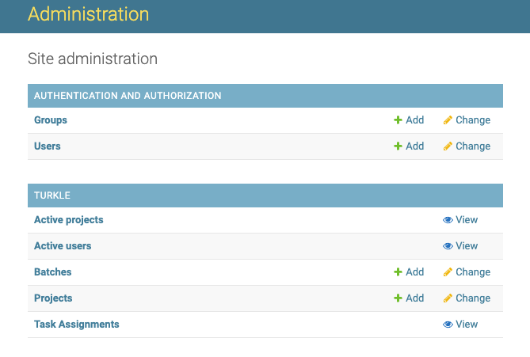

## Annotation Platform

Tool for annotation tasks based on turkle. Users can use given example HTML templates or Users can write their own HTML templates, then create a batch via csv and assign it to a specified annotator. After the task is completed, annotators' annotations can be reviewed and modified through the review function, and the final annotation results can be exported in the format of .csv file.

### installation

Refer to the [installation of turkle](https://turkle.readthedocs.io/en/latest/README.html#installation).

## terms

- project: An project is defined by a template of annotation interface. A template may contains template variables so that some data of annotation interface can be different from task to task. Here is the [guide](https://turkle.readthedocs.io/en/latest/TEMPLATE-GUIDE.html) to HTML template.

- batch: In a project, a batch is created by an input .csv file. The .csv file's column names must contains **all** template variables of template. For example, if there are ${template_variable1}, ${template_variable2} in the template, the input .csv file must have 2 columns named "template_variable1", "template_variable2". A batch can be assigned to certain users or user groups.
  
- task: In a batch, each row of the input .csv file will create a task by replacing template variables with the content of the same name column in this row. Annotators can accept tasks an implement them.

## create projects


Login with the superuser account and click "admin" on the top of index page to enter Administration page. click 'Add' of 'projects' entry to create a project.


Fill project_name and upload the HTML template, click 'SAVE', a tableQA annotation project is created.

## create batches

In project page, click 'Publish Tasks' to create a batch.

Fill batch name and upload CSV file, then click 'SAVE' button to redirect to the preview page. 


If there is no error, click 'Publish Batch' to publish them. Or click 'Cancel Batch' to cancel the batch.

## prepare input CSV file

- title: table's title
- table_link: the link of table in .csv format. If the table is of other format, you can rewrite `render_table` function to render them.
**Do not put quotation marks at it's beginning or end.**
- isUnderReview: always `false`
- other column: remain empty

## select cells of table

Press left mouse button to select one cell, drag the mouse to select an area of the table. Press the shift key when pressing or dragging to select more than one cells or areas. Click the blank area of page to clear the selection.

The selected areas' color will turn to yellow and their row and column index will be filled into the input box `area`.

## review batchs

When a batch is finished, click 'review results' button in the batch page.


Then the batch for review will be created and its name is `${reviewed batch's name}_review`. In every task of the review batch, input boxes for annotators will be automatically filled by annotator's annotation. Reviwer can still modify the contents.
And there will be an input box for reviewer to input review result under annotator's input boxes.

### modify contents that only for reviewers

if a batch is a review batch, the value of ${isUnderReview} is always `true` so more HTML elements are rendered to reviewers. 

- take line 110 of tableQA.html as an example:

```javascript
document.getElementById("review_input").innerHTML = '<p> Review input</p><input name="review" id="review"/>';
```

This line is to render HTML elements only for reviewers. Modify this line to define reviewer input boxes.

## modify template according to task

Templates can be modified for other types of tasks. If the number or name of the input boxes are changed, the Javascript code used to load the annotator input during review also needs to be modified.

- take line 108,109 of tableQA.html as an example:


```javascript
document.getElementById("question").value = '${question}';
document.getElementById("answer").value = '${answer}';
```

In the review batch, the question and answer that input by annotator will replace `${question}`, `${answer}` respectively and be filled in the 'question' and 'answer' input box. Then annotator's input can be seen and modified by reviewer. So if an input box with name "new_input_name" and id "new_input_id" is added to the HTML tmeplate, a Javascript statement

```javacript
document.getElementById("new_input_id").value = '${new_input_name}';
```

needs to be added here.

## download batch results

After finish reviewing, click 'CSV results' of the review batch to download the final result CSV file. In the result, each row is corresponding to a task. In the row, the modified annotations in the every input box of the task are in the cell of the same name as the input box. For example, if there is an input box in the template and its name is `input_box_name`, it's value after being modified bt reviewers will be in the column `input_box_name`.